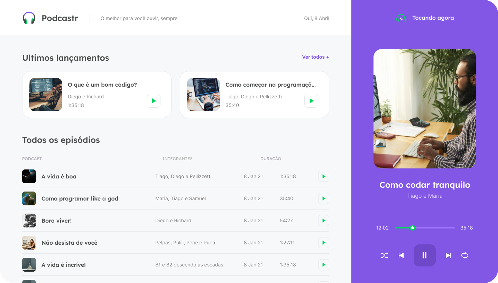

<h1 align="center">
  
</h1>

<p align="center">
  <a href="#-sobre-o-projeto">Projeto</a>&nbsp;&nbsp;&nbsp;|&nbsp;&nbsp;&nbsp;
  <a href="#-como-executar">Como executar</a>&nbsp;&nbsp;&nbsp;|&nbsp;&nbsp;&nbsp;
  <a href="#-tecnologias">Tecnologias</a>&nbsp;&nbsp;&nbsp;|&nbsp;&nbsp;&nbsp;
  <a href="#-licença">Licença</a>
</p>

# 💻 Sobre o Projeto

<p align="center">
  
  O podcastr é uma aplicação front-end que disponibiliza podcasts/músicas para serem tocadas no browser. Desenvolvida na semana NLW#05 utilizando React x Next.
</p>

## 🚀 Como executar

Para obter uma cópia do projeto na sua maquina basta seguir as seguintes etapas:

1. Clonar o repositório

```bash
  git clone https://github.com/SadVitorGomez/podcastr.git

  ou

  gh repo clone SadVitorGomez/podcastr
```

2. Instale as dependências do projeto

```bash
  yarn install

  ou

  npm install
```

3. Executar o projeto

```bash
  yarn dev

  ou

  npm run dev
```

## ✨ Tecnologias

Esse projeto foi desenvolvido com as seguintes tecnologias:

- [React](https://reactjs.org)
- [Next.js](https://nextjs.org/)
- [TypeScript](https://www.typescriptlang.org/)

## 📄 Licença

Esse projeto está sob a licença MIT. Veja o arquivo [LICENSE](LICENSE.md) para mais detalhes.
